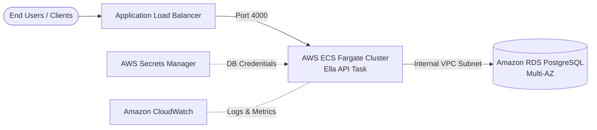

# Cloud Deployment Architecture Plan

**Platform Selected:** Amazon Web Services (AWS)  
**Architecture:** Containerized Serverless Microservice (AWS ECS Fargate + RDS PostgreSQL)  
**Author:** QA / DevOps Engineering  
**Date:** October 2026  

---

## 1. High-Level Architecture Diagram



---

## 2. Core Cloud Components

### 1. Compute: AWS ECS with AWS Fargate
- **Why Fargate?** Fargate is a serverless container compute engine. We do not need to manage, patch, or provision underlying EC2 virtual machines.
- **Scaling:** Automatically scales tasks based on CPU and memory utilization metrics.

### 2. Database: Amazon RDS for PostgreSQL
- **Managed Database:** Automatic backups, automated OS/Postgres patching, and Multi-AZ replication for high availability.
- **Network Isolation:** Placed in private VPC database subnets with security group rules allowing inbound traffic only from the ECS task security group on port 5432.

### 3. Networking & Traffic Distribution: AWS Application Load Balancer (ALB)
- Public-facing HTTPS entry point with SSL termination via AWS Certificate Manager (ACM).
- Health check configured to poll `GET /health` every 15 seconds to ensure traffic is only routed to healthy container tasks.

### 4. Configuration & Secrets: AWS Secrets Manager / SSM Parameter Store
- DB passwords, JWT secrets, and connection strings are stored securely in Secrets Manager.
- Injected into ECS container definitions as environment variables at task runtime, ensuring zero hardcoded secrets in the container image.

### 5. Logging & Observability: Amazon CloudWatch
- Container `stdout` and `stderr` logs are streamed directly to CloudWatch Logs via `awslogs` log driver.
- CloudWatch Alarms trigger alerts (SNS email/Slack) if 5xx error rate spikes or container task CPU exceeds 80%.

---

## 3. Step-by-Step Deployment Workflow

1. **Build & Push Image to AWS ECR (Elastic Container Registry):**
   ```bash
   aws ecr get-login-password --region us-east-1 | docker login --username AWS --password-stdin <ACCOUNT_ID>.dkr.ecr.us-east-1.amazonaws.com
   docker build -t ella-api:latest .
   docker tag ella-api:latest <ACCOUNT_ID>.dkr.ecr.us-east-1.amazonaws.com/ella-api:latest
   docker push <ACCOUNT_ID>.dkr.ecr.us-east-1.amazonaws.com/ella-api:latest
   ```

2. **Run Schema Migrations:**
   Run a one-off ECS migration task to apply `npm run migration:run` before updating service tasks.

3. **Deploy Service via ECS Rolling Update:**
   Update the ECS Task Definition with the new container image tag. ECS spins up the new container, verifies the `GET /health` check passes on ALB, and cleanly drains traffic from the old container (Zero-Downtime Deployment).

